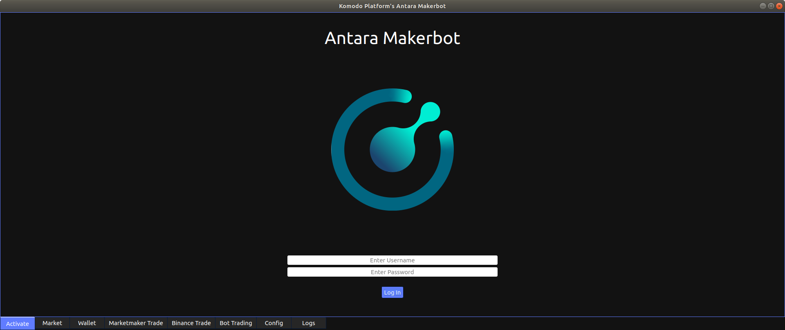
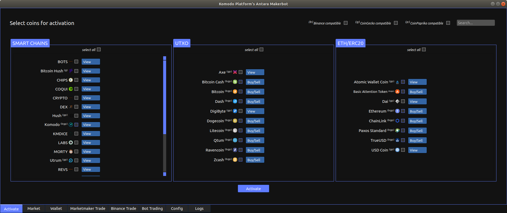
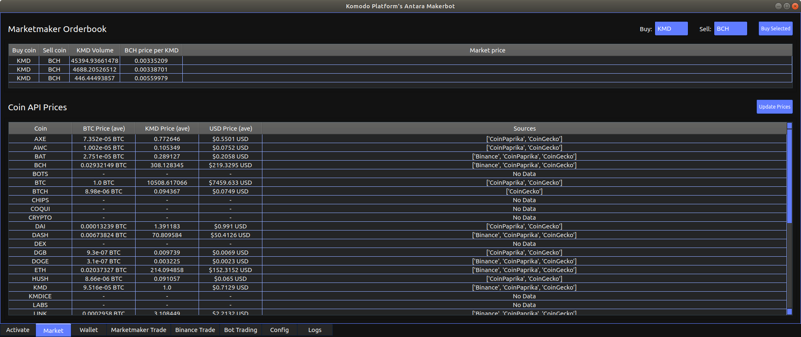

Anatara Makerbot Overview
=========================

The Antara Makerbot includes a number of tabbed pages as summraised below.

* `Activate`_: For authentication, loading coins and selecting which trade
* Market: Displays average market prices from API data, and view/purchase of available trades on the MarketMaker orderbook.
* Wallet: Simple interface for sending, recieving and viewing the balances of activated coins.
* Marketmaker Trade: Shows depth and allows manual order placement of selected pairs via Marketmaker, and shows tables of pending orders and completd swaps.
* Binance Trade: Shows Binance balances, open orders, and allows manual order placement for selected pairs.
* Bot Trading: Allows automated order placement of activated coin pairs on Marketmaker, and optional "at market" countertrades on completion via Binance.
* Config: Sets the parameters (e.g. seed phrase) for Marketmaker, Bot trading (e.g. trading premium) and Binance API keys (optional).
* Logs: Two console panels, which display raw Marketmaker stdout logs, and trading operations (orders place/completed).

Some tabs are only accessible if coin(s) have been activated, and the `Binance Trade`_ tab requires valid Binance API keys to view. Each tab and it's capabilities will be described in further detail below.

Activate
--------

If not already logged in, you will see the screen below:

Enter a username and password. If the username is not recognised, you will be given the option to add a new user. Your username will be used as a prefix for some config files, so dont use any troublesome chars. The first time you login, the app will redirect you to the `config`_ tab for initial setup and wallet seed generation. 

**Make sure to backup your seed!** - If you forget the password or your hard drive fails, it will not be recoverable.

Your password will be used as an encryption key for storing sensitive data locally, such as your seed phrase and API keys. After setting up your initial config, after a successful log in, your seed phrase and API keys will be decrypted on the fly, and used to launch the MarketMaker binary before revealing the coin activation view.

Coins are grouped into 3 categories:

* Komodo Smartchains (e.g. Labs)
* UTXO based coins (e.g. Bitcoin)
* ETH/ERC20 (e.g. Ethereum)

Each coin option may also have superscript indicators to show if they are Binance\ :sup:`(b)` compatible, or supported by CoinPaprika\ :sup:`(p)` or CoinGecko\ :sup:`(g)` price feed APIs.

Checkboxes at the top of each section (and the top left of the page) can assist in bulk selection of a coin category (or Binance/API compatible coins). The seach bar at the top left of the page can also filter the selection based on the name or ticker of each coin matching the entered search text.

Beside each coin is a drop down menu with the following options:

* View: Coins can be traded manually, and appears in the `wallet`_ tab
* Buy: Same capabilites as the "View" option, but also set as a coin to "Buy" when the bot is running.
* Sell: Same capabilites as the "View" option, but also set as a coin to "Sell" when the bot is running.
* Buy/Sell: Same capabilites as the "View" option, but also set as a coin to "Buy" and "Sell" when the bot is running.

This allows the bot to perform either one way or two way trades for each active coin, or load coins which the bot will effectively ignore. 

**Note:** Currently only Binance compatible coins will be used for bot trading. In future releases, it is intended to allow any coin with a reliable price API to be bot tradable on Marketmaker (but Binance counter trading will still be limited to Binance compatible coins only, obviously).

Market
------

    
