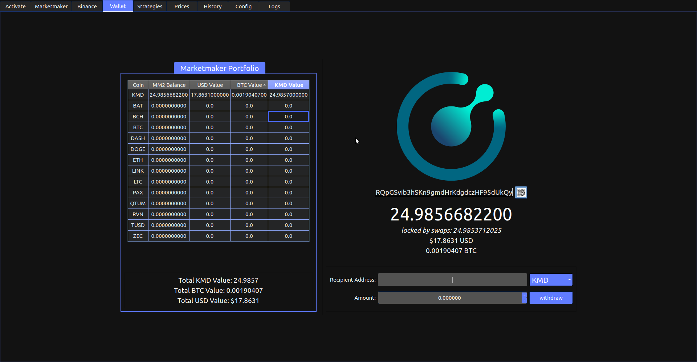
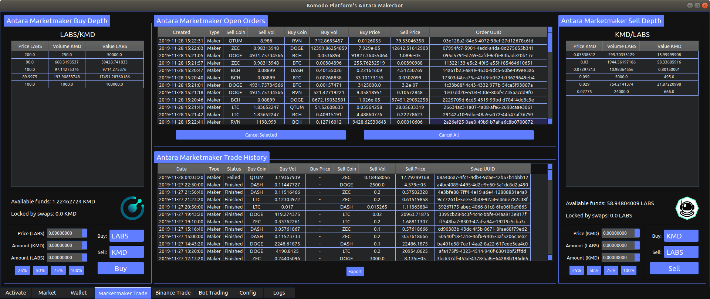
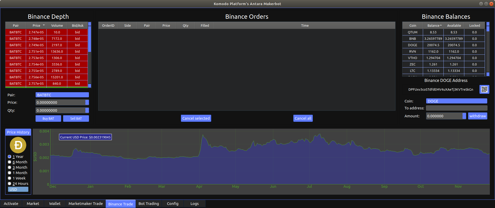
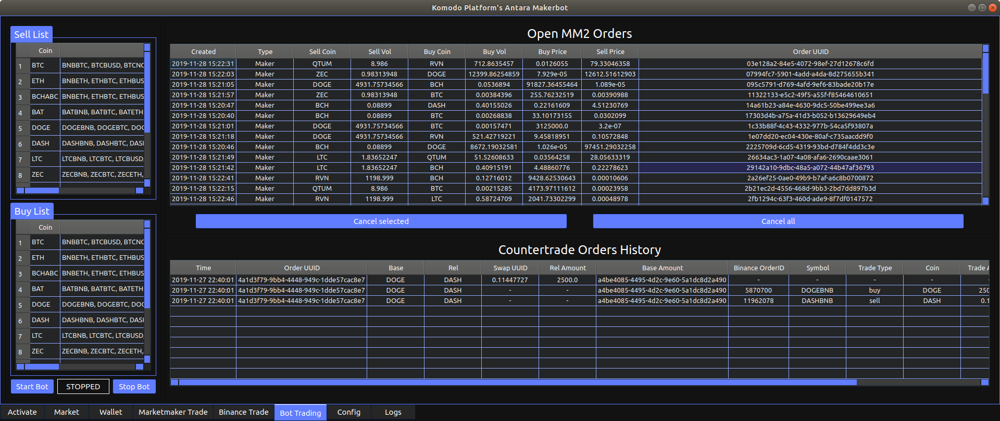
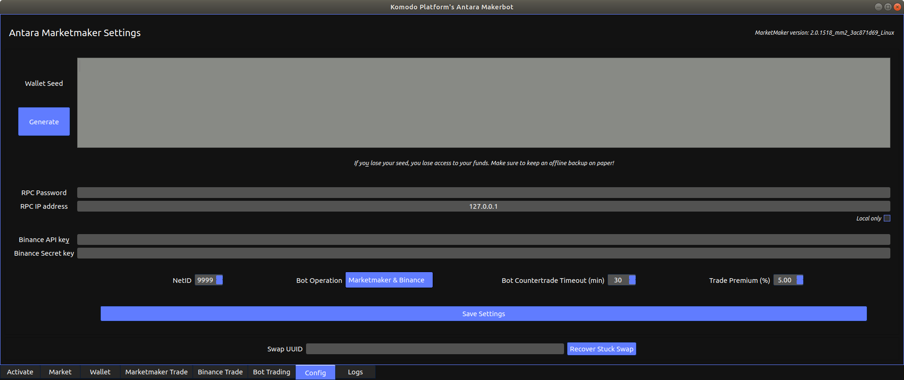

Anatara Makerbot Overview
=========================

The Antara Makerbot includes a number of tabbed pages as summraised below.

* `Activate`_: For authentication, loading coins and selecting which trade
* Market: Displays average market prices from API data, and view/purchase of available trades on the MarketMaker orderbook.
* `Wallet`_: Simple interface for sending, recieving and viewing the balances of activated coins.
* Marketmaker Trade: Shows depth and allows manual order placement of selected pairs via Marketmaker, and shows tables of pending orders and completd swaps.
* `Binance Trade`_: Shows Binance balances, open orders, and allows manual order placement for selected pairs.
* `Bot Trading`_: Allows automated order placement of activated coin pairs on Marketmaker, and optional "at market" countertrades on completion via Binance.
* `Config`_: Sets the parameters (e.g. seed phrase) for Marketmaker, Bot trading (e.g. trading premium) and Binance API keys (optional).
* `Logs`_: Two console panels, which display raw Marketmaker stdout logs, and trading operations (orders place/completed).

Some tabs are only accessible if coin(s) have been activated, and the `Binance Trade`_ tab requires valid Binance API keys to view. Each tab and it's capabilities will be described in further detail below.

Activate
--------

If not already logged in, you will see the screen below:

.. image:: img/activate_login.png
    :align: center
    :alt: Activate (login) tab

Enter a username and password. If the username is not recognised, you will be given the option to add a new user. Your username will be used as a prefix for some config files, so dont use any troublesome chars. The first time you login, the app will redirect you to the `Config`_ tab for initial setup and wallet seed generation. 

**Make sure to backup your seed!** - If you forget the password or your hard drive fails, it will not be recoverable.

Your password will be used as an encryption key for storing sensitive data locally, such as your seed phrase and API keys. After setting up your initial config, after a successful log in, your seed phrase and API keys will be decrypted on the fly, and used to launch the MarketMaker binary before revealing the coin activation view.

.. image:: img/activate_coins.png
    :align: center
    :alt: Activate (coins) tab

Coins are grouped into 3 categories:

* Komodo Smartchains (e.g. Labs)
* UTXO based coins (e.g. Bitcoin)
* ETH/ERC20 (e.g. Ethereum)

Each coin option may also have superscript indicators to show if they are Binance\ :sup:`(b)` compatible, or supported by CoinPaprika\ :sup:`(p)` or CoinGecko\ :sup:`(g)` price feed APIs.

Checkboxes at the top of each section (and the top left of the page) can assist in bulk selection of a coin category (or Binance/API compatible coins). The seach bar at the top left of the page can also filter the selection based on the name or ticker of each coin matching the entered search text.

Beside each coin is a drop down menu with the following options:

* View: Coins can be traded manually, and appear in the `Wallet`_ tab
* Buy: Same capabilites as the "View" option, but also set as a coin to "Buy" when the bot is running.
* Sell: Same capabilites as the "View" option, but also set as a coin to "Sell" when the bot is running.
* Buy/Sell: Same capabilites as the "View" option, but also set as a coin to "Buy" and "Sell" when the bot is running.

This allows the bot to perform either one way or two way trades for each active coin, or load coins which the bot will effectively ignore. 

**Note:** Currently only Binance compatible coins will be used for bot trading. In future releases, it is intended to allow any coin with a reliable price API to be bot tradable on Marketmaker (but Binance counter trading will still be limited to Binance compatible coins only, obviously).

Market
------

.. image:: img/market.png
    :align: center
    :alt: Market tab

This upper table of the market tab shows trades available in the Marketmaker orderbook for a given pair. The Buy/Sell coins of the orderbook pair can be selected via the dropdown lists at the top left of the page. By selecting a row in the table, and clicking the "Buy selected" button, you can buy directly from the orderbook at the offered price - a messagebox will appear for entering your desired purchase quantity.

The lower table of the market tab tracks the prices of all supported coins (even if not activated). The prices are expressed in USD, BTC and KMD, and averaged across all compatible price API sources. As API sources can vary in supported coins, the sources used are also listed for reference. This data is updated every minute or so.

Wallet
------

    
The wallet page is pretty straight forward. Select which activate coin you want to transact with via the drop down menu near the bottom right. It will display your balance (and value in USD/BTC if available) and  address (as text and as a QR code). Where available, the address text will be a hyperlink to a block explorer which you can click if you want to review your transactions or check confirmations. 

There are also inputs to send/withdraw funds to a different address. Simply enter the destination address and amount you want to send, and click the withdraw button. Where available, a link to the transaction on a block explorer will be shown after the funds are sent. If no block explorer is available, a transaction hash will be displayed instead.

Marketmaker Trade
-----------------

    
This tab allows you to buy or sell any pair of activated coins. The coin selection drop down menus on the bottom left and right are linked, with the left side showing the pair buy depth and the balance of the sell coin, and the right side showing sell depth and buy coin balance.

The top central table lists all of your open orders. Note that whether you buy or sell on this page, either way the "setprice" AtomicDEX method is used so you will always be the "Maker" and avoid paying taker fees. 

Orders can be cancelled individually by selecting a row in the table and clicking the "Cancel Selected" button, or you can cancel all open orders by clicking the "Cancel All" button. If you try to cancel an order which has a swap in progress, you will be asked to confirm the cancelation.

The lower central table shows a history of your past and current Marketmaker trades. For trades in progress, the latest event (e.g. TakerPaymentSent) in the atomic swap will be displayed. If you need to export this data, click the "Export" button and set the path/ filename to save it to a CSV file.

Binance Trade
-------------

**Note: Requires Binance API keys** 

This tab allows you to interact with your Binance account, placing orders and withdrawing depositing funds.

The panel on the left will show the market depth for a selected pair (via the dropdown menu at the bottom). You can enter a price (or click on a row to select a price) and quantity into the lower inputs, then click either the "Buy" or "sell" button to submit an order. Open orders will display in the central table. 

The panel on the right lists the balances of all coins in your Binance account. Selecting a coin from the dropdown list at the bottom will show the deposit address for your Binance wallet for the selected coin. You can also click on the QR code button to show a scanable QR code for your deposit address. 

Below your address are inputs to withdraw funds from Binance. Enter the destination address and amount to send, then click the "Withdraw" button. Please note that you will need to check Binance for the associated withdrawl fees and to get the transaction hash of the withdrawl.

The lower section displays a price history graph (via CoinPaprika) for the selected coin. This is probably going to move to the "Market page" in a future update.

Bot Trading
-----------

    
Config
------

    
Logs
----

.. image:: img/logs.png
    :align: center
    :alt: Logs tab
    
